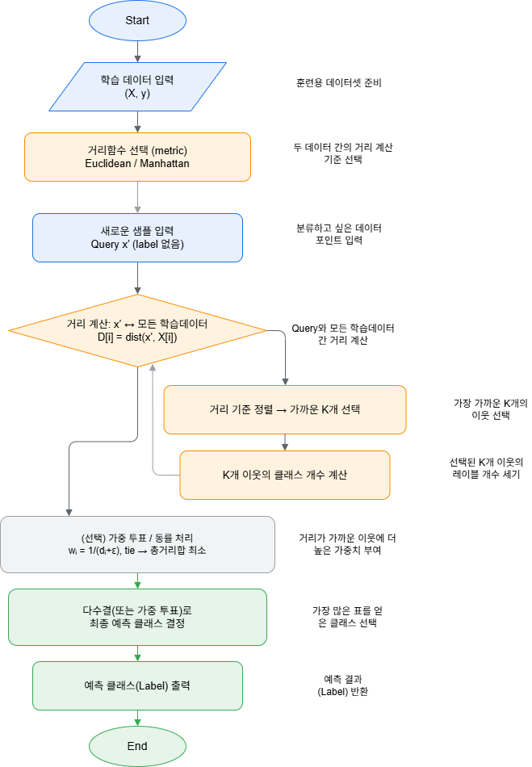
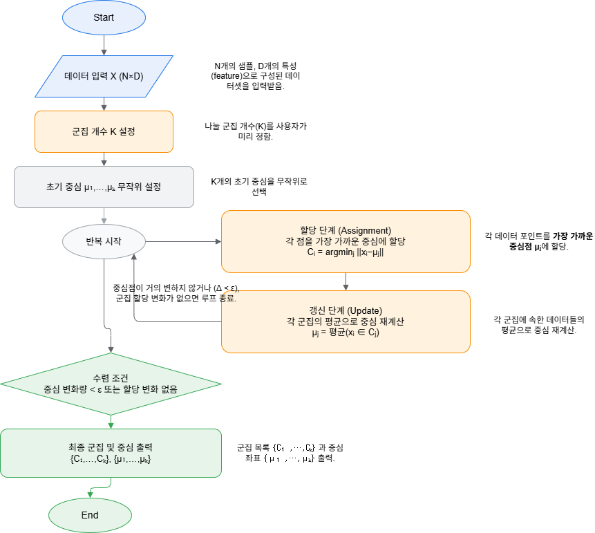
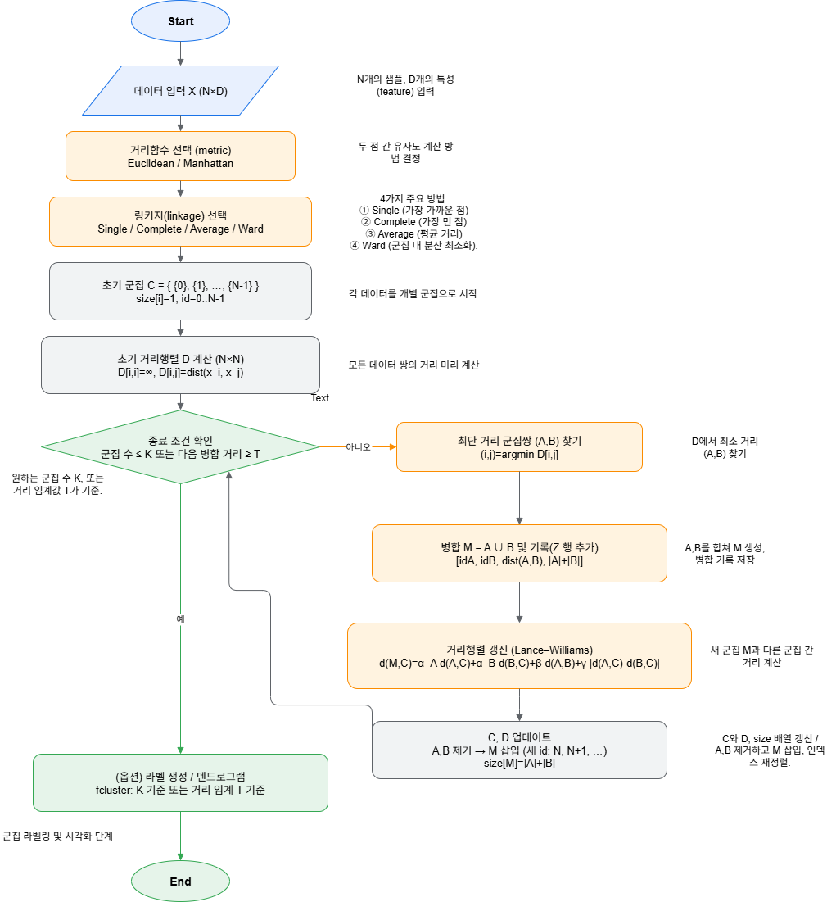

# 🧠 Machine Learning Algorithms: KNN · K-Means · Hierarchical Clustering

이 프로젝트는 **K-Nearest Neighbors (KNN)**, **K-Means**, **계층적 군집화 (Hierarchical Clustering)**  
세 가지 대표적인 머신러닝 알고리즘을 직접 구현하고 시각화한 실습 자료입니다.  
모든 알고리즘은 **Flowchart → From-Scratch 코드 → 시각화** 순으로 구성되어 있습니다.

---

## 📁 Repository Structure
```
AI-Clustering-Algorithms/
│
├── 01_KNN/
│ ├── knn.drawio.png
│ ├── knn.ipynb
│
├── 02_KMeans/
│ ├── kmeans.drawio.png
│ ├── kmeans.ipynb
│
└── 03_Hierarchical/
├── hierarchical.drawio.png
├── hierarchical_clustering.ipynb
```

---

## 🚀 How to Run (Colab Recommended)

1. 각 `.ipynb` 파일을 [Google Colab](https://colab.research.google.com/)에서 엽니다.  
2. 상단 메뉴 → **런타임 > 모든 셀 실행** 클릭  
3. 그래프 및 SSE / 군집 결과 시각화 확인  

> ⚙️ Environment: Python 3.10+, Numpy, Matplotlib  
> (`pip install numpy matplotlib` 로 설치 가능)

---

## 🧩 Algorithms Overview

| 알고리즘 | 학습 유형 | 주요 특징 | 핵심 포인트 |
|-----------|-----------|-----------|--------------|
| **KNN (K-Nearest Neighbors)** | 지도 학습 (분류) | 새로운 데이터를 주변 K개 이웃의 다수결로 분류 | 거리함수(Euclidean/Manhattan), 가중투표 |
| **K-Means** | 비지도 학습 (군집화) | 중심점을 기준으로 데이터를 K개의 그룹으로 분리 | 중심 갱신 / 수렴 조건 / SSE 최소화 |
| **Hierarchical Clustering** | 비지도 학습 (군집화) | 거리 기반으로 군집을 병합하며 덴드로그램 생성 | 병합(agglomerative), 거리링크(average/single/complete) |

---

## 🔁 Flowcharts (Core Logic)

### 🟦 1. KNN


| **KNN** | 데이터 입력 → 거리 계산 → K개 이웃 선택 → 다수결 분류 → 예측 출력 |

### 🟨 2. K-Means


| **K-Means** | 데이터 입력 → K 설정 → 중심 초기화 → [할당↔갱신 반복] → 수렴 시 결과 출력 |

### 🟩 3. Hierarchical Clustering


| **Hierarchical Clustering** | 거리 행렬 계산 → 가장 가까운 두 군집 병합 → 새 거리 갱신 → 군집 수 ≤ K일 때 종료 |

---


> 모든 파일은 동일한 색상 규칙을 사용합니다.  
> 🔵 입력 단계 / 🟠 계산 단계 / ⚪ 반복·보조 단계 / 🟢 결과 단계


**핵심 개념:**  
데이터를 K개의 중심점에 할당하고, 각 중심을 반복적으로 갱신하여 수렴할 때까지 수행합니다.


---

## 📊 Visualization Examples

| 알고리즘 | 시각화 예시 |
|----------|-------------|
| **KNN** | 테스트 데이터와 경계면 시각화 |
| **K-Means** | 클러스터 산점도 + 중심점(`*`) 표시 |
| **Hierarchical** | 덴드로그램(Dendrogram) 표시 및 임계 거리 컷 |

---

## 🧠 Code Review Highlights

| 단계 | 흐름도 대응 | 주요 코드 구문 | 설명 |
|------|--------------|----------------|------|
| **데이터 입력** | 데이터 입력 X | `X, y = make_blobs(...)` | N×D 형태 입력 데이터 준비 |
| **거리 계산** | 거리 계산 | `euclidean_sq(X, centers)` | 거리 제곱합 기반 최소 거리 탐색 |
| **군집 할당** | Assignment 단계 | `labels = np.argmin(dist2, axis=1)` | 각 점이 가장 가까운 중심에 할당됨 |
| **중심 갱신** | Update 단계 | `new_centers[j] = X[mask].mean(axis=0)` | 각 군집의 평균으로 중심 재계산 |
| **수렴 조건** | 수렴 조건 | `if shift < tol: break` | 중심 이동량이 일정 기준 미만이면 반복 종료 |

---

## ⚖️ Comparison Summary

| 항목 | KNN | K-Means | Hierarchical |
|------|------|----------|---------------|
| **학습 방식** | 지도학습 | 비지도학습 | 비지도학습 |
| **출력 형태** | 클래스(Label) | 군집 번호 | 트리 구조 |
| **복잡도** | O(nK) | O(n·K·iter) | O(n²) |
| **거리 사용 여부** | ✅ | ✅ | ✅ |
| **결과 시각화 용이성** | ⭐⭐⭐ | ⭐⭐⭐⭐ | ⭐⭐⭐⭐ |
| **설명력 (해석 용이)** | 높음 | 중간 | 높음 |

---

## 🧮 주요 수식

### KNN
d(x_i, x_j) = sqrt(sum_k (x_ik - x_jk)^2)
ŷ = argmax_c sum_i^K w_i [y_i = c]

### K-Means
C_i = argmin_j ||x_i - μ_j||
μ_j = (1 / |C_j|) * sum_(x_i ∈ C_j) x_i

### Hierarchical
d(A,B) =
min_{a∈A,b∈B} d(a,b) (Single-link)
max_{a∈A,b∈B} d(a,b) (Complete-link)
mean_{a∈A,b∈B} d(a,b) (Average-link)


---


## 🧭 Lessons Learned

- 단순한 알고리즘일수록 **직관적인 흐름도 설계**가 이해에 큰 도움이 됨  
- 거리 기반 알고리즘들은 **스케일링 영향**에 민감하므로 전처리 중요  
- 계층적 군집화는 시각적으로 유용하지만 **O(n²)** 복잡도로 대용량엔 부적합  
- 실습을 통해 “지도학습 vs 비지도학습”의 개념적 차이를 명확히 구분할 수 있었음

---
